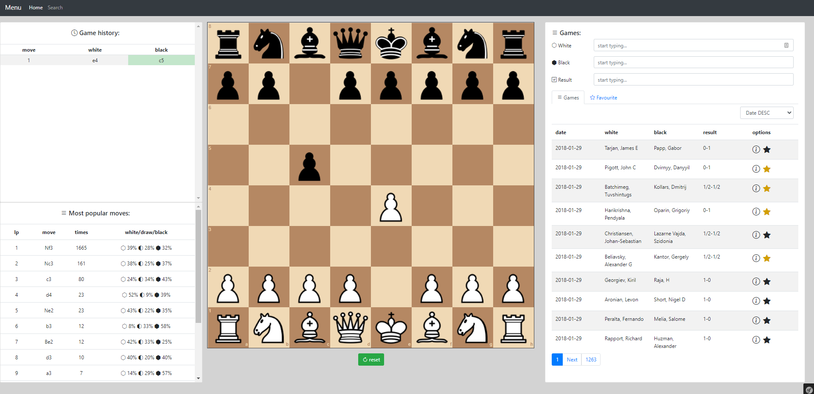

## Table of contents
* [General info](#general-info)
* [Technologies](#technologies)
* [Features](#features)
* [Installation](#installation)
* [Screenshots](#screenshots)

## General info
Symfony/vuex web based demo to explore/view chess games from the database.

## Technologies
Project is created with:
* Symfony 5.2
* Vue/Vuex
* vuex-pagination - https://github.com/cyon/vuex-pagination
* Chess.js
* Chess.php - https://github.com/ryanhs/chess.php
* Chessboard.js
* Risendy PGN parser - https://github.com/risendy/pgnParserBundle
* MySQL database

## Features
* importing pgn games into DB from pgn file using symfony command
* displaying paginated clickable games from db
* going through the games with next/prev buttons
* displaying most popular moves in the position
* playing the position from the start (useful for opening preparation)

## To do
* displaying game result for the most popular moves
* games searching
* position searching
* stockfish.js integration to analyse games

## Installation

install composer dependencies
```
composer install
```
install frontend dependencies
```
yarn install
```
compile assets
```
yarn encore dev
```
run migrations
```
php bin/console doctrine:migrations:migrate
```
import games from pgn file using symfony command. The file should exists in the public directory.
The command takes one input argument which is a name of the file eg. (games.pgn) 
For bigger files it may take a while (importing about 3 games per second)
```
php bin/console app:import-games --env=prod --no-debug filename 
```

## Screenshots

